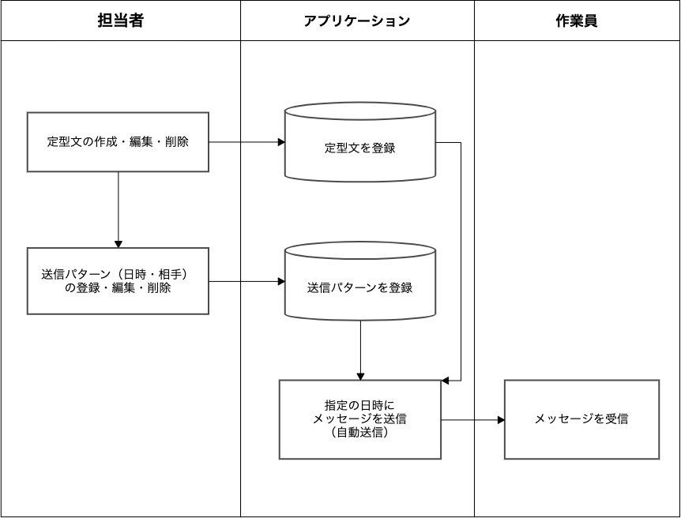
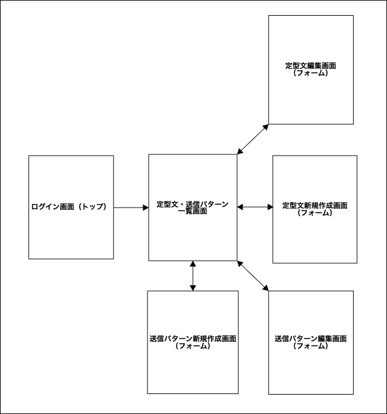
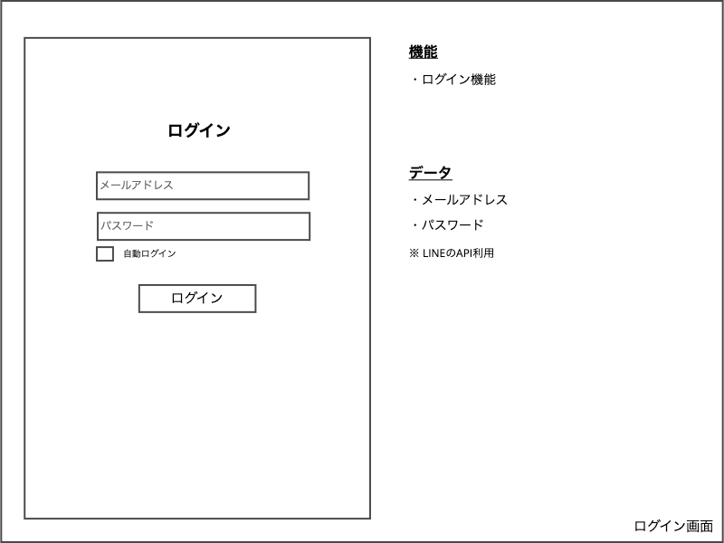
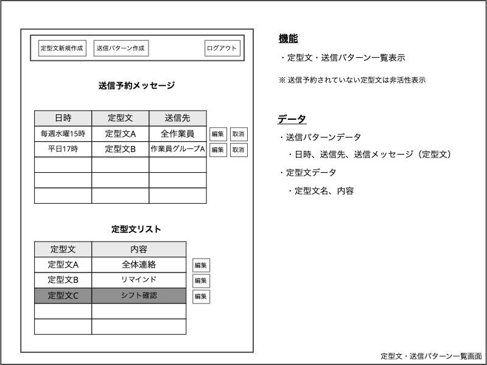
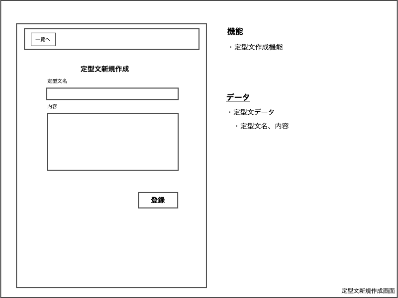
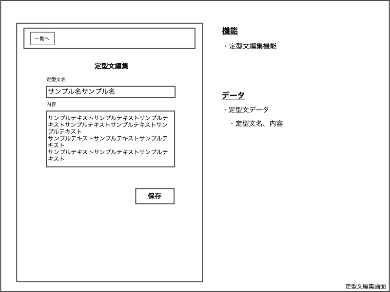
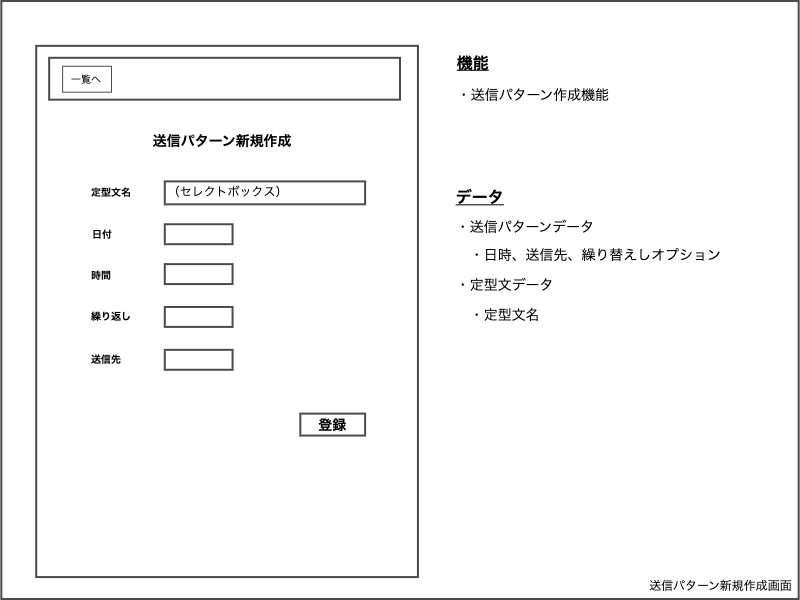
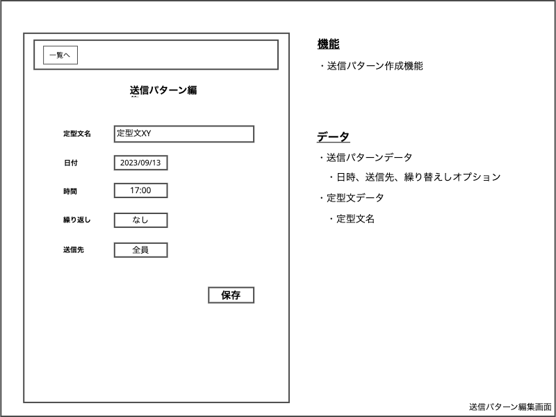

<h2>業務フロー図</h2>

- MVP（Minimum Viable Product）版

<h2>画面遷移図</h2>

- MVP（Minimum Viable Product）版

<h2>ワイヤーフレーム</h2>

- MVP（Minimum Viable Product）版

<h3>ログイン画面</h3>

<h3>定型文・送信パターン一覧画面</h3>

    

<h3>定型文新規作成画面</h3>

<h3>定型文編集画面</h3>

<h3>送信パターン新規作成画面</h3>

    

<h3>送信パターン編集作成画面</h3>

