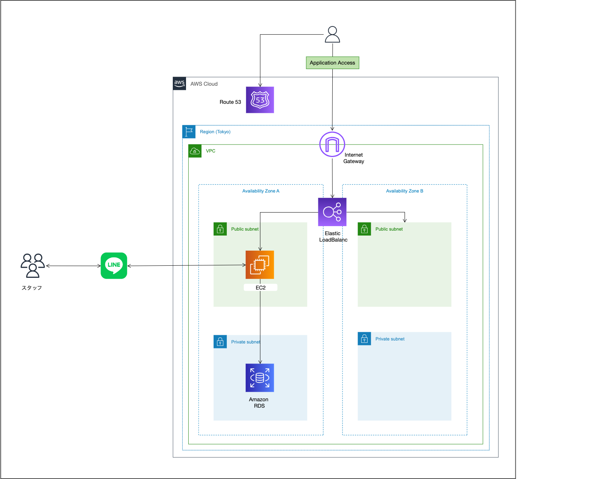

<h2>業務フロー図</h2>

- 暫定版

<h2>画面遷移図</h2>

- 暫定版

<h2>ワイヤーフレーム</h2>

- 暫定版

<h3>ログイン画面</h3>

<h3>定型文・送信パターン一覧画面</h3>

    

<h3>定型文新規作成画面</h3>

<h3>定型文編集画面</h3>

<h3>送信パターン新規作成画面</h3>

    

<h3>送信パターン編集作成画面</h3>

<h2>テーブル設計</h2>

※ コア機能分のみ。適宜アップデートします。

<h3>テーブル：template_messages</h3>

| カラム名    | データ型         | NULL | キー      | 初期値 | AUTO INCREMENT |
|---------|--------------|----|---------|-----|----------------|
| id      | BIGINT       | NO | PRIMARY |     | YES            |
| name    | VARCHAR(255) | NO |         |     |                |
| message | TEXT         | NO |         |     |                |

<h2>システム構成図</h2>

- 暫定版

